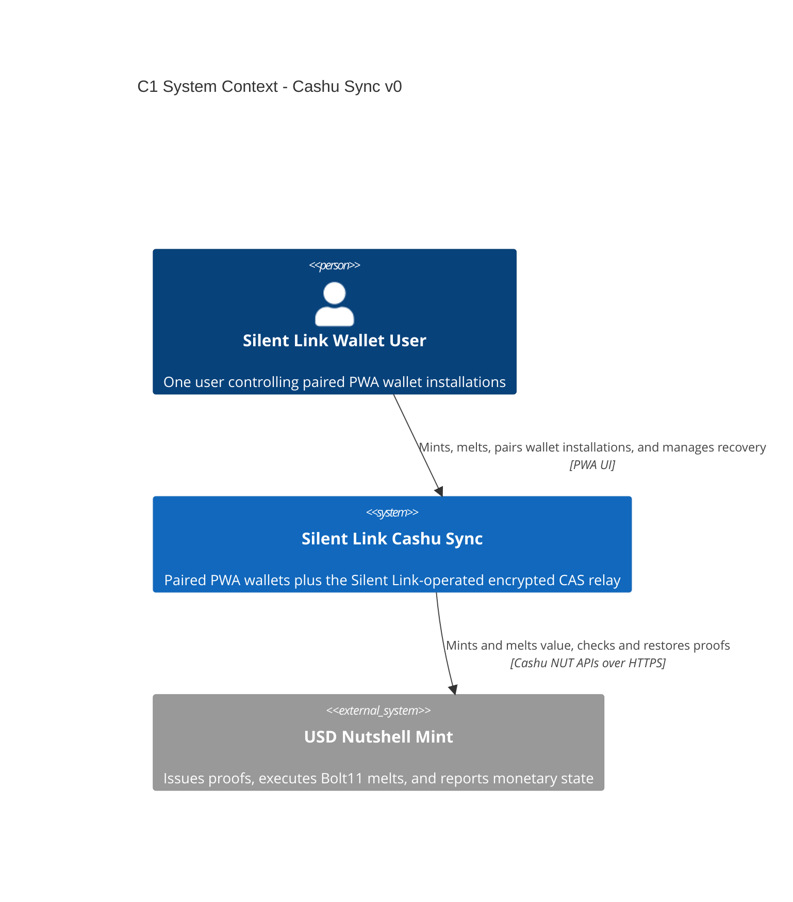

# C1 — System context

Status: **V0 implemented**

## Diagram

## Scope

One user controls paired Silent Link PWA wallet installations. Silent Link owns and operates the purpose-built sync relay, so both the PWA and relay are inside the Cashu Sync system boundary. A future CLI is roadmap exploration rather than a v0 client.

The wallet has two network relationships:

- **USD Nutshell mint:** the monetary authority and only recipient of plaintext proof-bearing Bolt11 mint/melt requests.
- **Silent Link-operated relay:** the purpose-built synchronization coordinator, which sees signed encrypted Nostr envelopes but cannot decrypt wallet state.

V0 supports Bolt11 USD mint, melt, balance, and accounting only. It has no peer-to-peer Cashu or peer-payment relationship.

## Recovery

The wallet lets the user export a passphrase-encrypted full-recovery bundle containing the twelve-word BIP39 mnemonic, random sync secret, authority endpoints, schema, and remembered head. A fresh PWA uses that authority to fetch the latest encrypted snapshot from the relay; the bundle does not contain a second copy of the snapshot.

## Trust boundary

Wallet clients create, sign, encrypt, decrypt, validate, and apply snapshots locally. The relay controls the current encrypted head but cannot determine the balance or modify a valid snapshot. Nutshell remains authoritative for quotes and proof state.
