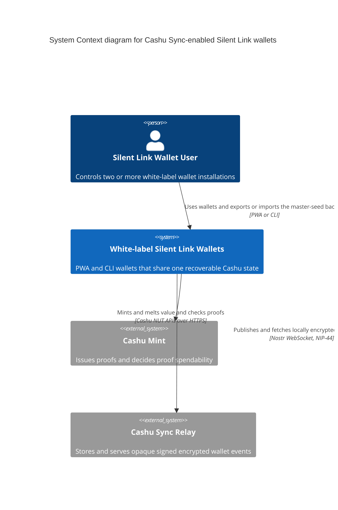

# C1 — System context

Status: **Proposed**

Audience: product, protocol, security, and engineering stakeholders.

## Diagram

## Scope

The user interacts with white-label Silent Link wallet clients, not with a separate Cashu Sync application. The user may run multiple installations in any supported combination, including PWA and CLI clients. Those installations represent the same recoverable Cashu wallet state and are all under the user's control.

Cashu Sync is the wallet-side protocol plus its relay-backed synchronization capability. Each wallet client uses one known mint for mint and melt operations and publishes or retrieves encrypted accounting events through a sync relay.

Peer-to-peer Cashu sending and receiving are outside this product's scope. The wallet is an accounting interface for value entering through mint operations and leaving through melt operations.

The relay is shown as an external software system because wallets communicate with it over a network API and must not depend on controlling its deployment. A service-specific deployment may operate both the branded wallets and the relay, but the trust boundary remains the same.

## Relationships

### Wallet user → wallet clients

The user controls and operates each wallet installation. Through a wallet client, the user can export or download the twelve-word BIP39 master-seed backup and later import it to recover the wallet after losing every device. The seed is an artifact handled by the wallet; it is never uploaded to the relay as plaintext.

### Wallet clients → Cashu Mint

This is the product's only proof-bearing network relationship. Wallet clients call the mint to mint value into the wallet, melt value out of it, check proof state, and restore deterministic outputs. They do not expose a Cashu send, receive, or peer-transfer flow.

### Wallet clients → Cashu Sync Relay

This is the relationship introduced by Cashu Sync. Each wallet client creates, serializes, signs, and encrypts state events locally before publishing them. The relay and its database store and return opaque ciphertext; they do not create events, encrypt wallet state, interpret proofs, or calculate balances.

Each client fetches and validates the retained event set on startup or restore and before every state-changing operation. While running, it should also subscribe or poll for updates. It decrypts accepted events locally, reconstructs a candidate wallet state, and asks the mint to reconcile the proof states relevant to the next operation.

## Cashu Sync responsibilities

- give every authorized wallet installation read and write access;
- synchronize automatically on startup, restore, and before state-changing operations;
- reconstruct wallet state from encrypted events and checkpoints;
- treat the mint as the source of truth for proof spendability;
- recover interrupted operations using durable intents and deterministic Cashu outputs;
- keep plaintext proofs, the master seed, and wallet metadata out of relay storage;
- avoid attaching a stable sync identifier to Cashu mint requests.

## Important artifact not modeled as a system

The twelve-word BIP39 master-seed backup is data, not a person or software system, so it appears on the user-to-wallet relationship rather than as a C4 node. Its derivation, export, and recovery role are documented in [the protocol specification](../spec.md#6-key-hierarchy).

## Notation

- **Person:** the human who controls the wallet installations and backup.
- **Software System:** the user's white-label wallet clients as the system being documented.
- **External Software System:** the mint and sync relay reached by wallet clients.
- **Arrow:** the initiator and action, labeled with the interface or protocol.
