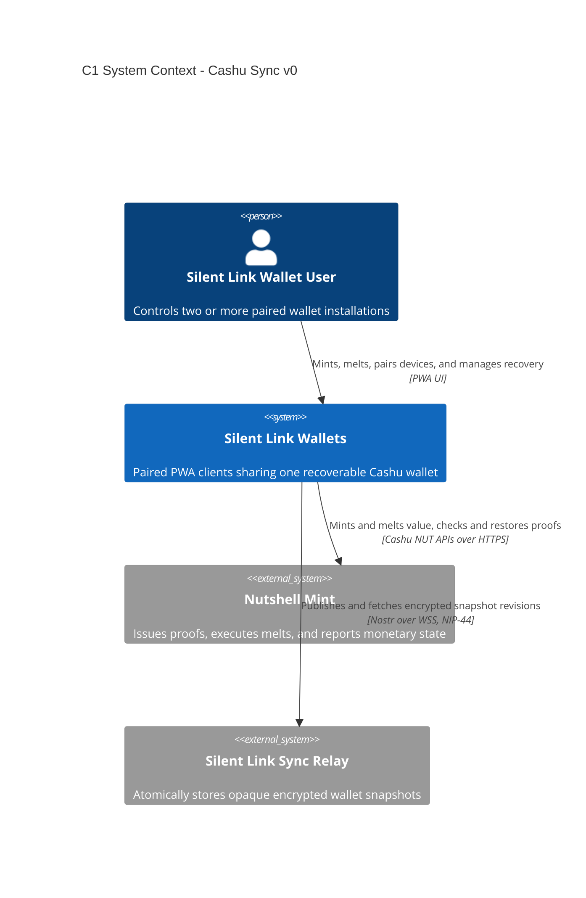

# C1 — System context

Status: **V0 accepted**

## Diagram

## Scope

One user controls multiple paired Silent Link wallet installations. V0 implements phone-first PWAs; the protocol remains suitable for a future CLI.

The wallet has two network relationships:

- **Nutshell mint:** the monetary authority and only recipient of plaintext proof-bearing requests.
- **Silent Link relay:** the synchronization coordinator, which sees signed encrypted Nostr envelopes but cannot decrypt wallet state.

V0 supports mint and melt accounting only. It has no peer-wallet or payment-transport relationship.

## Recovery

The wallet lets the user export the twelve-word BIP39 mnemonic for deterministic funds recovery and an encrypted full-recovery bundle containing both the mnemonic and random sync secret. The latter also recovers relay history and pairing continuity.

## Trust boundary

Wallet clients create, sign, encrypt, decrypt, validate, and apply snapshots locally. The relay controls the current encrypted head but cannot determine the balance or modify a valid snapshot. Nutshell remains authoritative for quotes and proof state.

