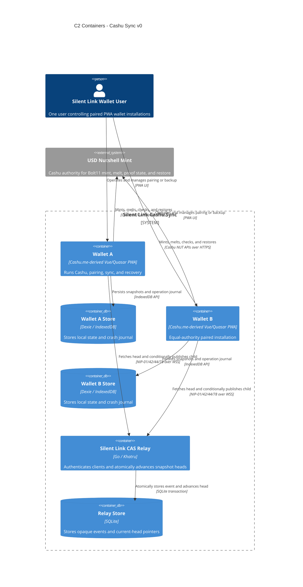

# C2 — Containers

Status: **V0 implemented**

## Diagram

## Wallet containers

Wallet A and Wallet B are representative deployed copies of the same PWA, controlled by one user. Both hold the Cashu seed and dedicated sync secret, so both have equal authority. There is no peer-to-peer transfer between them: they synchronize one wallet.

Before a mint or melt, a wallet:

1. fetches and atomically imports the current encrypted snapshot;
2. resumes any pending operation through Nutshell quote and exact-output recovery calls;
3. writes a prepared pending operation locally;
4. conditionally publishes it as a child of the relay head;
5. contacts Nutshell only after relay acceptance;
6. persists the response locally and publishes the completed snapshot.

The local IndexedDB store is a cache and crash journal, not the only backup.

## Relay containers

The purpose-built, Silent Link-operated Go relay reuses Nostr WebSocket, signature, subscription, and NIP-42 behavior. Its wallet-specific responsibilities are production admission from a startup-loaded sync-pubkey allowlist and atomic compare-and-swap: the incoming `prev` event ID must equal the SQLite head. Paired wallets share one admitted sync key. Open admission exists only for loopback-bound local end-to-end tests.

The relay does not decrypt snapshots, calculate balances, reconcile proofs, or call Nutshell. V0 runs one relay process with one persistent SQLite volume. GitHub Pages hosts only the static PWA, never this stateful service.

## Deployment note

A future CLI is another Wallet container using the same encrypted schema and relay protocol. It is not part of the first v0 implementation.
