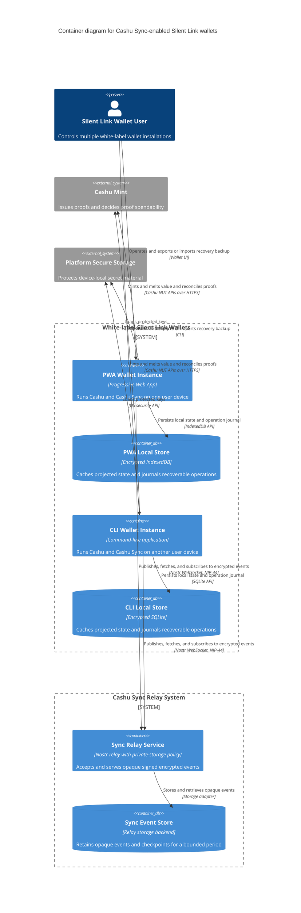

# C2 — Containers

Status: **Proposed**

Audience: protocol implementers, application engineers, and infrastructure engineers.

## Diagram

The PWA and CLI containers are representative wallet installations, not a fixed topology. A user may run two PWAs, two CLIs, or any larger supported combination. Every installation has its own local store and device key while sharing access to the same logical wallet state.

## Container responsibilities

### PWA and CLI wallet instances

Every instance is an equivalent writer; there is no permanent primary device. The wallet client—not the relay—creates, serializes, signs, and NIP-44-encrypts sync events.

An instance synchronizes automatically:

1. on startup, foreground resume, pairing, or restore;
2. before every state-changing operation;
3. continuously while active, using a subscription where supported and polling otherwise;
4. after publishing a local mutation, to observe acknowledgements and concurrent events.

Before changing state, an instance fetches retained checkpoints and later events, validates signatures and authorization, decrypts events locally, reconstructs the event-derived wallet projection, and reconciles relevant proofs and pending operations with the mint. It selects proofs and NUT-13 counters only from that reconciled state.

The instance persists a durable intent before destructive mint interaction and preserves new outputs locally before removing old proofs. It also provides a deliberate backup and restore flow through which the user can export or download the BIP39 master-seed backup and later import it on a replacement device.

### Local wallet stores

Each local store is a cache and crash journal for one wallet installation, not the sole wallet backup. It holds:

- the latest trusted checkpoint and event frontier;
- projected proofs and cached mint states;
- exact pending mint requests and responses;
- NUT-13 counter high-water marks and reservations;
- relay publication acknowledgements.

The PWA normally uses encrypted IndexedDB, while a CLI normally uses encrypted SQLite. An implementation may choose another device-local encrypted store with equivalent durability semantics.

### Sync Relay Service

The relay exposes the Nostr publication and subscription interface. It accepts and serves opaque, signed, NIP-44-encrypted events and applies authentication, retention, size, and rate-limit policies.

It does not encode or encrypt wallet data. It is not trusted to:

- order wallet transitions;
- return a complete or fresh event set;
- interpret Cashu proofs or decrypt wallet events;
- calculate a wallet balance;
- resolve conflicting proof consumption.

The wallets must work with a service-operated, independent, or replicated relay without changing their state semantics.

### Sync Event Store

The relay's storage backend retains encrypted intents, commits, authorization events, and checkpoints. The proposed retention period is six months, with active wallets publishing a self-contained checkpoint after approximately four to five months.

NIP-40 expiration tags are advisory; deletion and retrieval policy must be enforced by the relay deployment. Wallet clients never query this database directly; they use the relay protocol.

### Platform Secure Storage

This external platform facility protects, where available:

- the raw BIP39 seed used by a full writer;
- the Cashu Sync wallet group key;
- a random device-specific signing key;
- the local database encryption key.

The user-facing twelve-word backup may be revealed or exported only through an explicit wallet action. It remains an offline recovery artifact and must never be sent to the relay as plaintext.

## Trust boundaries

Plaintext proofs and key material remain inside each wallet instance and its platform storage. Events are encrypted and signed by a wallet instance before they cross the network boundary to the Sync Relay Service.

The Cashu Mint sees normal Cashu request fields and network metadata. Sync publication is deliberately outside the mint transaction boundary so that mint requests do not carry a stable sync namespace or commit identifier.

Peer-to-peer Cashu token transfer is outside the product scope. Proof-bearing requests go only from a wallet instance to the Cashu Mint for mint, melt, proof-state, and recovery operations. The sync relay receives signed encrypted accounting events, never plaintext proofs.

The Sync Relay Service can still observe device pubkeys, timestamps, approximate event sizes, IP addresses, and access patterns. A mint-operated relay improves availability but lets one operator compare mint and sync metadata. Independent or replicated relays provide better separation at additional operational cost.

## Multi-device semantics

The diagram shows two example instances to make the synchronization need visible. Each installation has its own Local Wallet Store and random device signing key while sharing the wallet's BIP39 derivation authority and wallet group decryption capability.

The key hierarchy is documented in [the protocol specification](../spec.md#6-key-hierarchy); it is not a separate C4 container hierarchy.

## Notation

- **Container:** an independently running PWA, CLI, relay, or database.
- **Container Database:** a logical datastore used by one running container.
- **External Software System:** a capability outside the wallet and relay boundaries.
- **Arrow:** the initiator and action, labeled with the transport or API.
