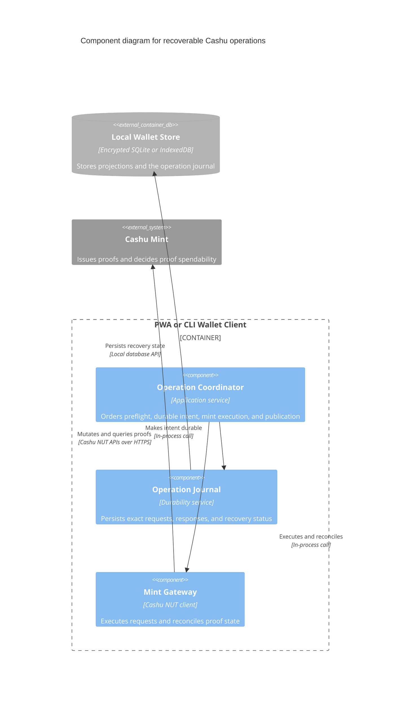

# C3 — Cashu operation safety components

Status: **Proposed**

Audience: wallet developers and protocol implementers.

This focused component view covers proof reconciliation, durable operation intent, mint interaction, and interrupted-operation recovery inside one PWA or CLI Wallet Client container.

## Diagram

## Component responsibilities

### Operation Coordinator

Synchronizes and validates current state before the flow shown here begins. It selects and reserves the specific proof objects and NUT-13 counters used by an operation. Before a destructive mint request, it asks the Operation Journal to make the exact intent durable.

New outputs and recovery material become durable before old proofs are removed from the local projection. Mint success followed by failed sync publication is therefore recoverable rather than atomic.

### Operation Journal

Durably records `op_id`, exact request material, input object IDs, reserved counters, blinded outputs, responses, and publication status. It preserves enough information to retry an idempotent request or restore deterministic outputs after a crash.

### Mint Gateway

Uses NUT-07 and optional NUT-17 notifications to reconcile relevant proofs. It executes canonical mint and melt requests and recovers interrupted responses or outputs through NUT-19 and NUT-09/NUT-13.

The State Engine and Key Manager are shown in the companion [synchronization component view](./c3-wallet-sync-components.md). Before entering this flow, the Operation Coordinator obtains a current event-derived candidate state and durably reserves NUT-13 counters and deterministic output material. Structural state alone does not establish proof spendability; the Mint Gateway reconciles relevant proofs when needed.

## Fault-tolerance invariant

The design does not require atomic commit between a Cashu mint and the sync relay. The mint is the source of truth, while deterministic outputs, durable intents, replay, restore, and reconciliation make partial completion repairable.

The normative operation and recovery sequences are specified in [the protocol specification](../spec.md).

## Notation

- **Component:** non-deployable responsibility inside one PWA or CLI Wallet Client container.
- **External Container/Database:** deployable dependency shown in the Level 2 diagram.
- **External Software System:** system outside Cashu Sync.
- **Arrow:** initiator and action, labeled with the in-process API or network protocol.
