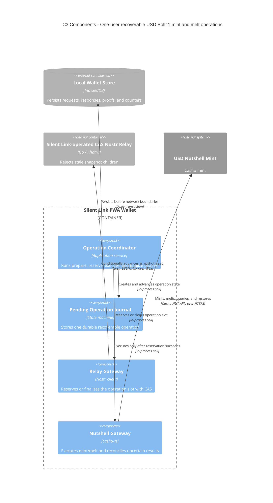

# C3 — Mint/melt safety components

Status: **V0 implemented**

## Diagram



## Safety boundary

The relay and Nutshell do not participate in a distributed transaction. Safety comes from order and recoverability:

```text
local prepared journal
  → accepted pending-operation snapshot
  → exact Nutshell request
  → local durable response/outputs
  → accepted completed snapshot
```

A relay conflict before the Nutshell request is a clean retry. A crash or conflict after the request requires reconciliation; the wallet preserves all request, counter, response, and proof material until the result is known.

An unresolved operation does not expire automatically and blocks a new operation across paired wallets. The next wallet uses quote state, plus the already journaled wallet-side NUT-13 material and mint-side NUT-09 restoration for exact prepared mint outputs, to finish or safely clear it. The reference profile's one-hour NUT-19 cache permits exact-request replay but is not a durable source of truth after expiry.

Both PWA installations belong to one user and operate one wallet. The journal coordinates those installations; it is not a peer-to-peer send or receive protocol.
