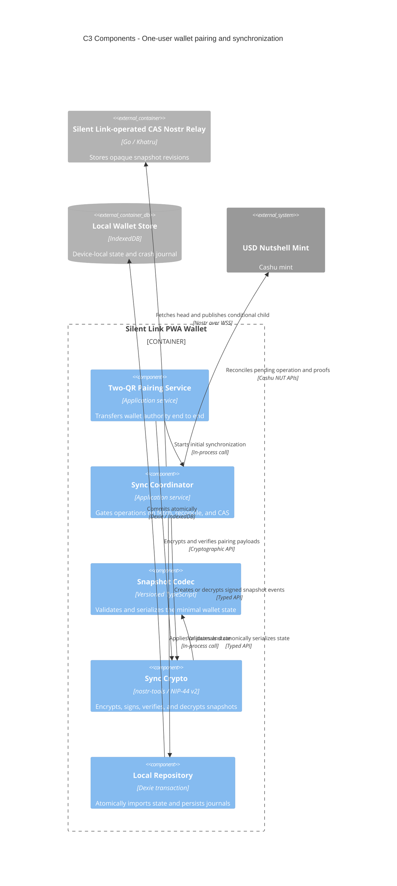

# C3 — Wallet synchronization components

Status: **V0 implemented**

## Diagram

## Responsibilities

### Pairing Service

For one user controlling paired PWA wallets, QR 1 carries an ephemeral key, challenge, and five-minute expiry without wallet secrets. After explicit approval, QR 2 carries the mnemonic, random sync secret, authority mint, relay URL, schema, and current head encrypted to that request. Local testing may copy the text rendered below each QR. V0 has no deeplink pairing transport and no peer-to-peer payment path.

### Sync Coordinator

Runs on startup, foreground resume, pairing, recovery, and before Bolt11 mint/melt. It enforces the critical rule: no state-changing mint call occurs until the relay accepts the prepared pending-operation snapshot.

### Snapshot Codec

Serializes only the v0 schema—proofs, counters, quotes, accounting history, and one pending operation. It does not dump arbitrary localStorage or browser database contents.

### Sync Crypto

Uses a dedicated shared sync key, independent of social Nostr identity and Cashu proof derivation. It verifies the event and the agreement between outer `prev` and encrypted `previous_event_id` before state is applied.

### Local Repository

Applies a validated remote snapshot and its remembered head in one Dexie transaction. A crash cannot expose half-imported wallet state.
