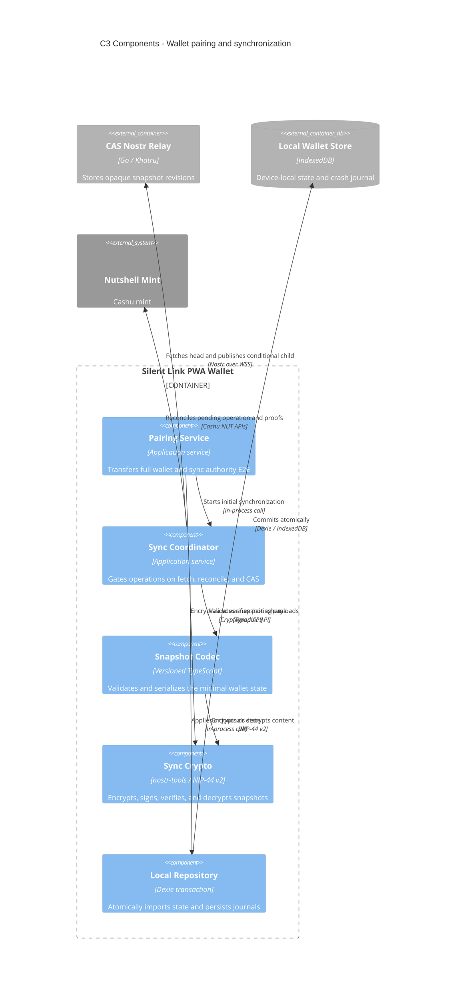

# C3 — Wallet synchronization components

Status: **V0 accepted**

## Diagram

## Responsibilities

### Pairing Service

Uses explicit user approval and ephemeral pairing keys to transfer the mnemonic, random sync secret, configured mint, relay URL, and current head. It never puts secrets in the deeplink or relay plaintext.

### Sync Coordinator

Runs on startup, foreground resume, pairing, recovery, relay notification, and before mint/melt. It enforces the critical rule: no mint call occurs until the relay accepts the prepared pending-operation snapshot.

### Snapshot Codec

Serializes only the v0 schema—proofs, counters, quotes, accounting history, and one pending operation. It does not dump arbitrary localStorage or browser database contents.

### Sync Crypto

Uses a dedicated shared sync key, independent of social Nostr identity and Cashu proof derivation. It verifies the event and the agreement between outer `prev` and encrypted `previous_event_id` before state is applied.

### Local Repository

Applies a validated remote snapshot and its remembered head in one Dexie transaction. A crash cannot expose half-imported wallet state.

