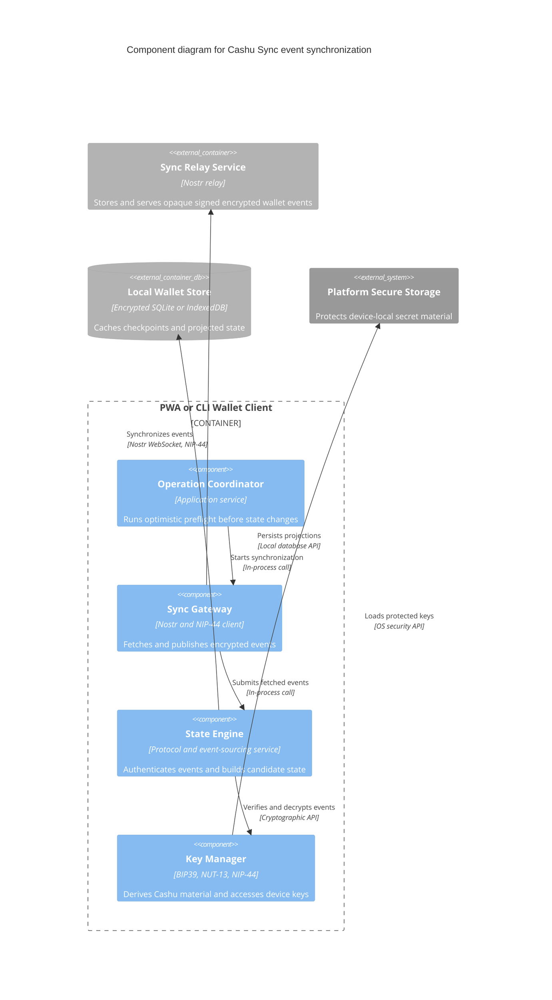

# C3 — Wallet synchronization components

Status: **Proposed**

Audience: wallet developers and protocol implementers.

This focused component view covers encrypted event retrieval, validation, projection, and publication inside one PWA or CLI Wallet Client container.

## Diagram

## Component responsibilities

### Operation Coordinator

Owns the multiwriter optimistic-concurrency invariant:

> Every authorized device may write, but each state-changing operation starts by synchronizing, reconstructing, and validating the latest known state.

It does not require a global wallet head or lock. It asks the State Engine for a current candidate projection before selecting state objects or reserving NUT-13 counters.

### Sync Gateway

On startup, foreground resume, pairing, and restore, fetches checkpoints and later events. Before every mutation it refreshes the event frontier; while active it subscribes or polls for new events. It signs and encrypts transitions locally before publication, records relay acknowledgements, and may compare frontiers across replicated relays.

### State Engine

Validates the Nostr event ID and Schnorr signature, checks device authorization and epoch, authenticates and decrypts the NIP-44 payload, and validates canonical object references. NIP-44 already authenticates its ciphertext, so Cashu Sync does not add a redundant application MAC.

It projects structural candidates from a trusted checkpoint and accepted later events, records localized conflicts when multiple events consume the same state object, and distinguishes structural candidates from mint-confirmed spendable proofs.

### Key Manager

Implements standard NUT-13 derivation from the BIP39 seed, versioned domain-separated Cashu Sync derivation, wallet group encryption, and random per-device signing keys. Exact Cashu Sync KDF encodings require test vectors before implementation.

## Consistency boundary

The relay is not a consensus system. A structurally valid event projection is only a candidate view; the Cashu Mint remains authoritative for whether a proof is spendable. Missing an unspent proof is the critical safety failure. Retaining an already-spent proof is a repairable stale-state condition.

Pairing, user-controlled master-seed export and recovery, checkpoint scheduling, and rollback detection across relay replicas are specified in [the protocol specification](../spec.md).

## Notation

- **Component:** non-deployable responsibility inside one PWA or CLI Wallet Client container.
- **External Container/Database:** deployable dependency shown in the Level 2 diagram.
- **External Software System:** capability outside Cashu Sync.
- **Arrow:** initiator and action, labeled with the in-process API or network protocol.
