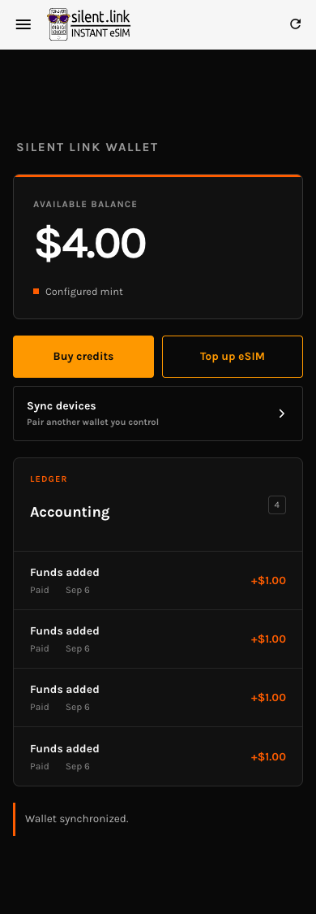

# Manual E2E: interrupted mint recovery — 2026-09-06

Code validated: `241bbf3`.

Result: PASS for the single-wallet interrupted-mint recovery flow. Conducted interactively through the built PWA in visible Chrome, with Playwright used for individual UI actions, request interception, and read-only IndexedDB inspection. This was not a run of the existing E2E suite.

## Environment

- Fresh isolated Chrome profile; final visual inspection at 390 × 844.
- Locally built production PWA at `http://127.0.0.1:8096`.
- Actual Go CAS relay at `ws://127.0.0.1:3344`, dedicated SQLite database.
- Pinned Nutshell 0.20.3 with the repository FakeWallet/USD and Redis NUT-19 fixture at `http://127.0.0.1:3348`, isolated Compose project `cashu-sync-manual-20260906`.
- No real funds. Responses were not fabricated: failures were injected by aborting browser network requests or discarding actual successful mint responses. Wallet storage was inspected but not edited.

## Observations

| Scenario | Injection/action | Observed result |
| --- | --- | --- |
| Paid quote interrupted before issuance | Buy $1, abort mint POSTs, inspect journal and mint quote, release interception and reload | Before recovery: journal `submitted`, quote `PAID`, no new balance. After reload: credit recovered. Repeated with a second $1 purchase to capture network evidence. |
| Exact-request recovery | Capture the interrupted POST and the POST after reload; compare parsed request bodies | Exactly one recovery POST; body identical to original. Balance 200 cents, six proofs, two paid history entries, pending journal cleared. |
| Repeated reload | Reload twice after the second recovery | Balance stays $2.00; zero mint POSTs. |
| One lost successful response | Forward the next $1 mint request, observe HTTP 200, discard its response once | Library retry recovered the credit; two observed mint POSTs, no restore call; balance $3.00. |
| NUT-09 recovery | Forward the next $1 mint POST once, discard its HTTP 200 response, then abort every subsequent mint POST | Ten intercepted mint POST attempts in total, one `/v1/restore` request; balance 400 cents, four paid history entries, pending journal null. |
| Continued usability | Create subsequent purchases through the same wallet after recovery | Purchases continued successfully; final reload retained $4.00 and four paid entries. |

The first observation script waited for the transient text `Recovery status: completed` and timed out after the UI had already reached `Wallet synchronized.` with the correct balance. The scenario was repeated using balance and persisted-state checks. This was an observation-script mismatch, not a recovery failure.

## Follow-up

Persistent network failure produced 43 intercepted mint POST attempts during the second interrupted purchase before the recovery message settled. The installed cashu-ts transport retries NUT-19-cacheable requests, and the wallet also retries reconciliation. Recovery remained correct, but the combined retry count deserves a separate bounded-retry/latency review. These counts are observations of this run, not protocol constants.

This validation does not measure real Lightning settlement, failure frequency in production, or recovery on a second paired device. It does not validate changes to snapshot capacity or service-worker update policy.

## Final interface

