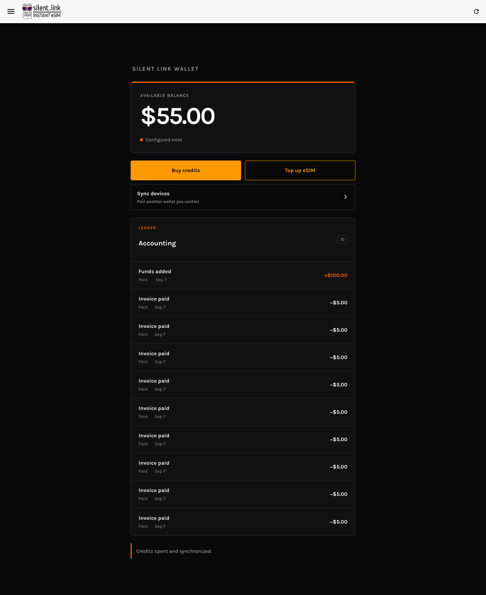

# Pruned history and Top Up recovery — 2026-09-06

## Root causes and fixes

A device older than the relay's eight retained snapshots could not prove its
remembered predecessor, so synchronization stopped before payment. Recovery now
combines the authenticated current snapshot with locally held proofs, checks
spendability at the mint, preserves counters and operation recovery material,
and publishes the corrected state. Conflicting or unauthenticated data is not
silently trusted.

The demo Top Up also bypassed the durable operation journal. It now prepares and
persists the exact swap before submission, always spends inputs at the mint,
and restores its exact outputs after a lost response. Final publication
conflicts can adopt an equivalent completed result from another device;
pre-submission conflicts retry against the refreshed state. The live concurrency
check also found that recovering another quote could report the current request
as complete. Outcomes now carry the completed quote ID, and the service retries
the intended request after unrelated recovery. Two regression cases failed
before this correction and passed afterward.

The recovery screen exposes retry, pairing, and local unreserved-token export
when automatic recovery cannot finish. Export reads local storage without
requiring either service and does not erase tokens. A receiving wallet must
check/redeem those tokens at the mint; export alone does not prove spendability.

The availability requirement is recorded in the root AGENTS.md.

## Reproducible browser check

Run a production build configured with the public Fly demo mint, sync relay,
and pairing relay. Serve it locally, then run from `wallet/`:

```sh
PLAYWRIGHT_CHANNEL=chrome CASHU_SYNC_E2E_WALLET_URL=http://127.0.0.1:8097/ \
  node node_modules/@playwright/test/cli.js test \
  tests/e2e/pruned-history-recovery.spec.ts --headed
```

The test uses two fresh Chrome contexts, real UI pairing and payments, and
read-only IndexedDB inspection. Only transport failures are injected. It uses
Nutshell FakeWallet demo credits, not real funds or Lightning settlement.
Service workers are disabled for deterministic build selection; upgrade
behavior is not covered.

The stale device starts at revision 4 with $100. Its peer makes five $5 Top Ups,
reaching revision 20 and $75. Reopening the stale device must consult mint proof
states, converge to $75, and complete another $5 Top Up. Both devices must hold
$70 after reload, with no pending operation.

Next, the test forwards one swap to the real mint and drops its successful
response. The wallet must restore its change and settle at $65. Two concurrent
$5 Top Ups must then converge to $55 with both journals clear. Finally, with
mint HTTP and relay WebSocket connections blocked, local token export must
remain accessible and leave the local balance intact.

## Verification

Production source: `c9d730d` plus the one-second conflict retry pacing change. Wallet unit tests: 372 passed, 16 skipped.
Production PWA build and lint of changed code passed.

Final live run: **PASS** (3.9 minutes, completed 2026-09-07).

- Stale revision 4 / $100 recovered from peer revision 20 / $75 with one mint proof-state request; a $5 Top Up and reload left both at $70.
- Exactly one swap was forwarded before its successful response was dropped. Mint restoration recovered the change automatically; balance became $65. Two restore requests occurred across the later recovery/concurrency phase.
- Two simultaneous $5 requests completed. Both devices reached revision 35, $55, and a null pending journal.
- Blocking mint HTTP and relay WebSockets still allowed exporting local unreserved tokens; persisted balance stayed $55.
- Earlier concurrency attempts exposed false completion of an unrelated quote and exhaustion of rapid conflict retries. Quote matching and a one-second pause before retry corrected the observed cases. This run demonstrates recovery, not a guarantee that every possible concurrency schedule settles within the bounded retry limit.


