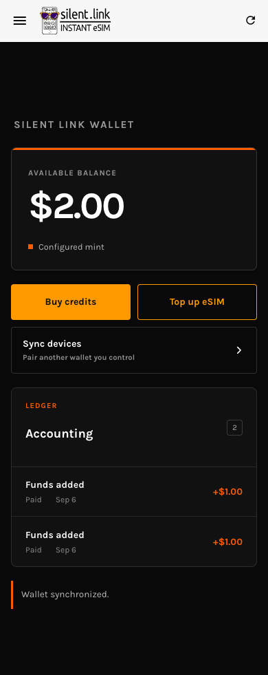

# Real E2E: relay-first recovery — 2026-09-06

Result: **PASS** for interrupted mint recovery across two paired browser devices and mint fallback during relay unavailability. Code validated: `a3180fc` (includes the fix discovered in this run).

## Environment and method

- Built production PWA at `http://127.0.0.1:8096`.
- Actual Go CAS relay at `ws://127.0.0.1:3344` and pairing relay at port 3345.
- Actual Nutshell 0.20.3 at port 3348, using the isolated FakeWallet/USD + Redis test fixture. No real funds or real Lightning settlement.
- Two fresh isolated Chrome contexts, paired using the UI's generated pairing URL. A parked `about:blank` page simulated a closed device without modifying its persisted wallet state.
- Playwright drove actual UI controls. IndexedDB was inspected read-only. No wallet records, relay results, mint responses, or proof material were fabricated.
- Faults were injected by aborting HTTP requests to the mint or closing browser WebSocket connections to the relay. The real services supplied every successful response.
- Service workers were blocked in the final fresh contexts to ensure the tested assets belonged to this build. Service-worker update behavior is outside this test.

## Findings and correction

The first two-device attempt exposed a real startup regression: `authorityMintUrl` is an in-memory field that resets on reload. The cached-mint check incorrectly required it to already match, forcing a mint bootstrap before relay recovery. With the mint unavailable, startup failed.

The regression test was changed to use the real post-reload empty value, failed, and passed after boot began rebinding the field from the validated authority payload. Fix committed as `a3180fc`. All scenarios below were then repeated from fresh browser contexts.

## Final observed run

| Scenario | Action and evidence | Result |
| --- | --- | --- |
| Pair devices | A creates a pairing QR; B opens its URL and completes pairing | Both start at revision 2, zero balance, no pending operation. |
| Interrupt A | Buy $1 and abort mint POSTs; inspect durable state; park A | A remains `submitted`, revision 4, balance 0. |
| Complete on B | Reopen B and let it recover through the real relay/mint | Exactly one mint POST, with body identical to A's persisted request. Revision 6, balance 100 cents, one paid entry, journal cleared. |
| Recover A through relay | Block all mint HTTP requests and reopen A | Revision 6, balance 100 cents, one paid entry, journal cleared. **Zero mint requests**, including metadata. |
| Reload A again | Keep mint blocked and reload | Same state, no duplicate credit, still zero mint requests. |
| Relay unavailable | Start another $1 purchase, interrupt before mint issuance, then reopen with relay WebSockets closed and mint available | Exactly one recovery mint POST, identical to the interrupted request. Balance 200 cents, two paid entries; `response_recorded` remains durable at revision 8. |
| Reload during relay outage | Keep relay unavailable and reload | Balance remains $2.00; both history entries remain paid; journal remains `response_recorded`; no additional mint POST. UI shows `Reconnecting wallet…`. |
| Restore relay | Reconnect relay, block all mint HTTP requests, reload | Final publication advances revision to 9 and clears journal. Balance stays 200 cents; **zero mint requests**. UI shows `Wallet synchronized.` |

The initial interruption produced 42 aborted mint POST attempts in the two-device scenario and 43 in the fallback scenario. The separate combined-retry-budget issue remains open; these numbers describe this run, not protocol limits.

The inspection script initially waited for `Recovery status: needs-reconciliation`, but the live connection indicator replaces it with `Reconnecting wallet…`. The final run accepts the actual connection state and also asserts persisted journal, balance, history, and request counts.

## Verification and scope

- Full wallet suite: 358 passed, 16 skipped, 35 files.
- Production PWA build and lint of changed TypeScript files passed.
- Sanitized counters and persisted-state summaries: [JSON evidence](relay-first-recovery-2026-09-06.json).
- This run validates mint recovery. Melt recovery and malformed retained relay history remain covered by automated tests, not by this browser run. It does not validate production failure frequency, real Lightning settlement, or service-worker upgrades.

